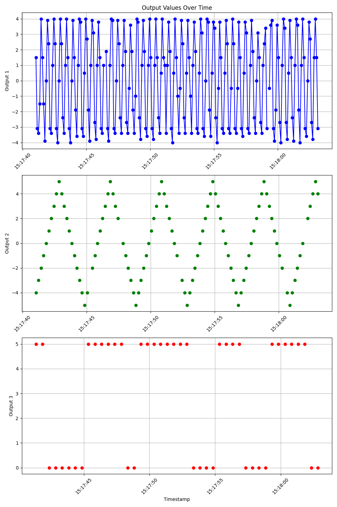

# Embedded Linux Homework Task

## Initial Setup

Install Docker and load the Docker image present in the directory:
```
docker load -i fsw-linux-homework.tar.gz
```

Run it:
```
docker run -p 4000:4000/udp -p 4001:4001 -p 4002:4002 -p 4003:4003 fsw-linux-homework
```

The Docker image contains a server application that exposes three TCP ports
(4001, 4002, 4003) and produces data on them. Additionally, the server operates
a "control channel" by listening for messages on UDP port 4000 and reacting to
them.

## Server output analysis 


| Output | Frequency(Hz)  | Amplitude(mV) |  Shape / Wave |
| :----: | :------:       | :-------:     |     :---:     |
| out1   |   1(500)       |   5000        |     sine      |
| out2   |   0.5(250)     |   5000        |   triangular  |
| out3   |   0.25(125)    |   5000        |    square     |

## Design Description

### Task1
Initially, a Python script(`scripts/tcp_client.py`) was developed to analyze the frequency, minimum, and maximum values of data outputs, with the structure inferred from terminal observations. Subsequently, the focus shifted to creating a C client application with three main objectives:

1. Ensure proper reception of data from the socket.
2. Output Unix timestamps in milliseconds and format the data into JSON.
3. Meet timing requirements, including recent data output and handling scenarios where data reception fails.

While the first two objectives were successfully achieved, challenges arose with the third. Despite exploring various approaches, satisfactory solutions couldn't be found. Subsequently, the concept of a multithreaded client was conceived. 

In multithreaded design, each thread would collect data from the sockets simultaneously, while the main thread would handle output string printing and halt data collection from the sockets in the running threads upon reaching a 100ms threshold. This approach aims to effectively address the timing constraints and data inconsistencies.

Finally, verification was conducted by manually checking whether data repetition occurred and if the timings satisfied the requirements.
Please find the log file named `logs/client_multi_100ms.log`

### Task2
For the task of controlling the server, a UDP client(`scripts/udp_client.py`) was developed using Python to retrieve property values such as amplitude and frequency. The client script sends messages to a UDP server in a control protocol format, instructing the server to read property values ranging from 0 to 65535. Upon receiving these instructions, the UDP server prints the corresponding property values on its terminal without sending any data back to the client.

To identify the property IDs for frequency and amplitude, the server terminal logs of all outputs were manually copied and pasted into files under a designated `logs` directory. This allowed for the extraction and analysis of property values from the server logs, facilitating the identification of the specific property IDs associated with frequency and amplitude.

With the previous work, modified the C implementation of Task 1 to control the server. Key changes involved creating a UDP socket, crafting messages in line with the control protocol, and confirming if the server's "out1" frequency and amplitude aligned with specifications.

Subsequently, a script(`scripts/plot_outs.py`) was developed to plot data from the `logs/client_multi_100ms.log` log file, aiming to determine exact frequency, amplitude, and shape. Through this process, discrepancies in initial frequency assumptions became apparent. A manual graph was then drafted, facilitating frequency calculations based on collected data, later validated using the `server_outs.png` image.
Please find the log file named `logs/client_multi_20ms.log`
